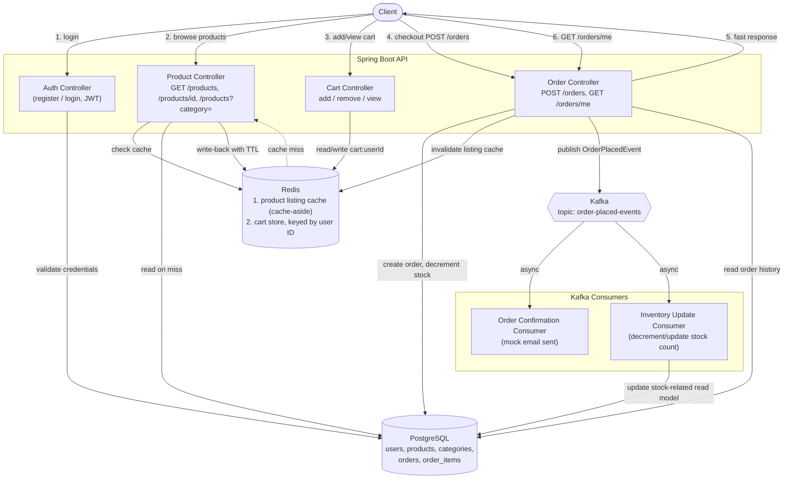

# Architecture

## Overview

The system is a single Spring Boot service backed by three data/messaging components, each chosen for a specific access pattern rather than "because it's standard":

- **PostgreSQL** — durable, relational data: users, products, categories, orders, order items
- **Redis** — two roles: cache-aside for product listings, primary store for the shopping cart
- **Kafka** — decouples checkout from its side effects (confirmation, inventory update)

## Request flow diagram

## Component responsibilities

### Spring Boot API
Stateless REST layer. Handles auth (JWT issuance/validation), request validation, and orchestrates calls to Postgres, Redis, and Kafka. No business logic lives in the controllers — it's delegated to a service layer so it stays testable and mockable.

### PostgreSQL
System of record for anything that needs durability and relational integrity: users, products, categories, orders, and order items. This is what you'd back up, migrate, and run real queries/reports against.

### Redis — two distinct roles

**1. Product listing cache (cache-aside)**
- On `GET /products` / `GET /products?category=`: check Redis first
- Cache hit → return cached JSON directly, skip Postgres
- Cache miss → query Postgres, write result to Redis with a TTL, return to client
- On stock update (checkout): invalidate the relevant cached listing so it doesn't serve stale stock counts past the TTL window

**2. Cart storage (primary store, not a cache)**
- Cart is stored in Redis keyed by user ID (e.g. `cart:{userId}`), not in a Postgres table
- Every add/remove/view operation reads and writes Redis directly — there's no "source of truth" table it's shadowing
- Chosen because cart data is high-write, ephemeral, and doesn't need relational guarantees; keeping it out of Postgres also keeps the transactional order-creation path simpler

### Kafka — decoupling checkout side effects
- Checkout (`POST /orders`) does the minimum synchronous work: create the order row, decrement stock, invalidate the cache, publish an `OrderPlacedEvent` — then returns to the client
- Two independent consumers subscribe to that event:
  - **Order confirmation consumer** — sends (mocked) confirmation
  - **Inventory update consumer** — updates inventory-related state
- Because these run asynchronously off the main request path, a slow or failing notification step can't slow down or fail checkout itself. Each consumer can also be scaled, retried, or replaced independently.

## Data flow summary by use case

| Use case | Path |
|---|---|
| Browse products | API → Redis (cache-aside) → Postgres on miss |
| View/update cart | API ↔ Redis directly (no Postgres involved) |
| Checkout | API → Postgres (write) → Redis (cache invalidation) → Kafka (publish event) → fast response |
| Post-checkout side effects | Kafka → consumers (confirmation, inventory) asynchronously |
| Order history | API → Postgres (read) |

## Known gaps / not yet done

- Full docker-compose wiring for Postgres + Redis + Kafka + app together
- Broader test coverage beyond the current single integration test
- No live deployment yet
- No payment gateway (checkout mocks a "payment success" step by design — out of scope for this project)